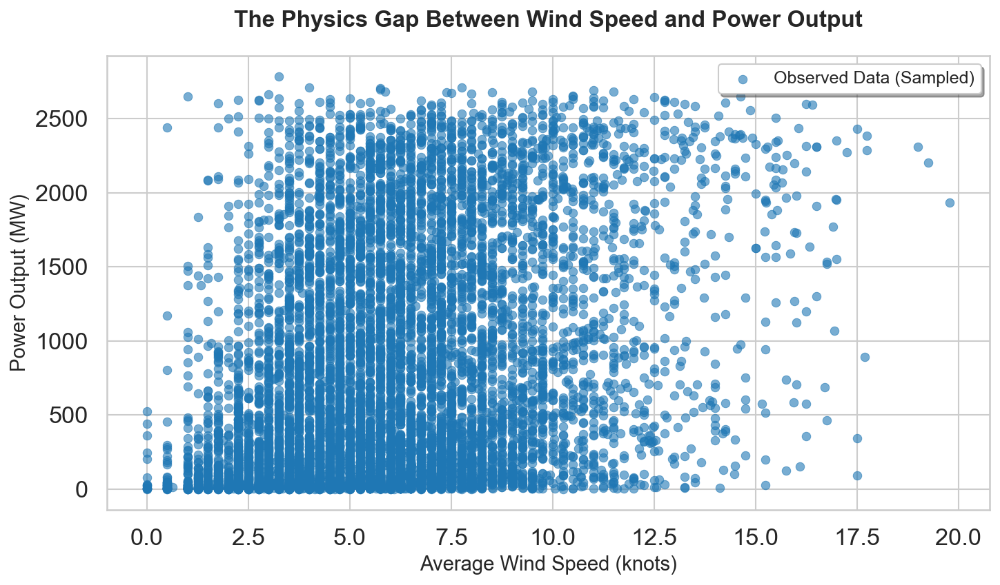
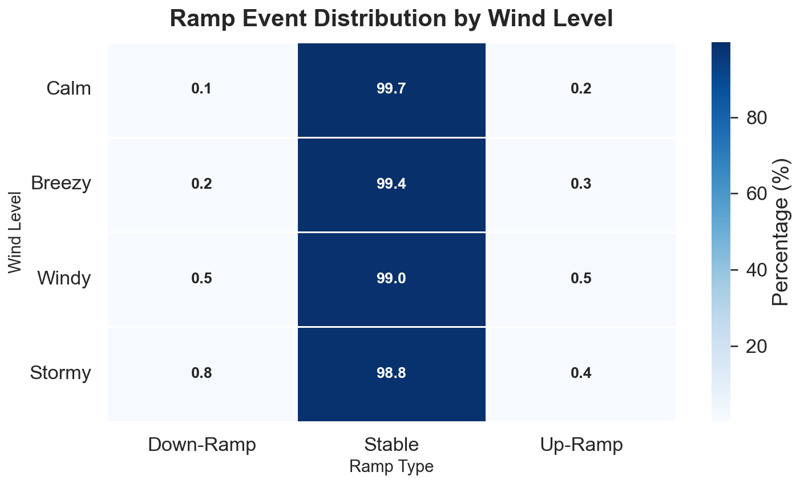
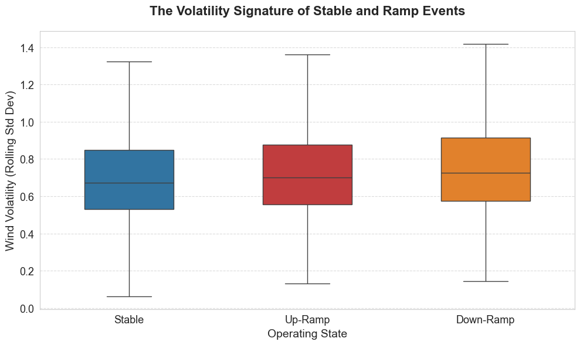
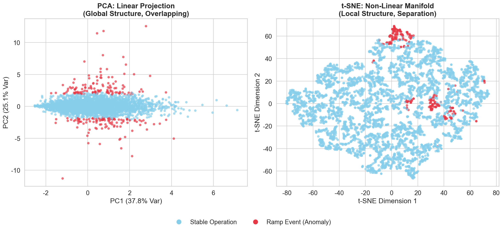
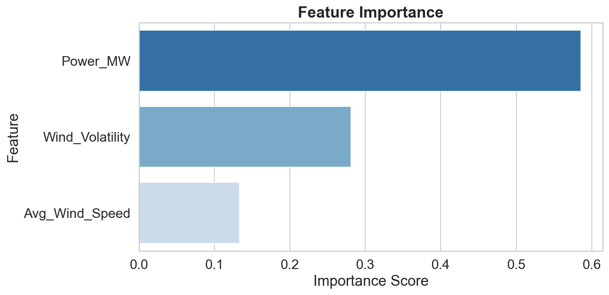

# Wind Power Ramp Events: Visual Evidence, Operational Risk, and Early-Warning Insights

## 1. Introduction

Wind power has become a critical pillar of the modern energy system, supporting decarbonization goals and reducing reliance on fossil fuels.
However, wind power's short-term variability creates serious operational risk for power systems.
A large body of research has shown that wind power ramp events---rapid and large increases or decreases in output over short periods---pose significant challenges for grid operations because they can lead to power imbalances, higher balancing costs, and reliability concerns.
@GallegoCastillo2015

The study of wind power ramps has attracted increasing attention in both academic and industry circles, with early surveys highlighting the difficulty of defining and forecasting these events and summarizing state-of-the-art approaches.
@GallegoCastillo2015 Historically, definitions of ramp events and forecasting methods have varied widely, motivating work on probabilistic ramp forecasting to better quantify uncertainty and support operational decision-making.
@ZhengKusiak2017

Despite advances in forecasting methods and evaluation metrics, existing approaches often require detailed numerical weather prediction inputs or complex models that are not always practicable for real-time operational awareness.
@Ahn2022 @Worsnop2018 Moreover, predictability challenges remain, particularly under localized or abrupt variability conditions, reinforcing the need for approaches that emphasize observable signals and structural patterns.
@PereyraCastro2022

This report focuses on understanding why ramp events occur and how early indicators of ramp risk can be recognized using readily observable weather conditions and variability measures.
Rather than emphasizing algorithmic performance, our analysis highlights visual evidence and operationally intuitive signals that can support earlier awareness and more resilient grid management.

## 2. Objective: What This Analysis Aims to Support

The objective of this analysis is to help people recognize the power fluctuation risks in the operation of wind power generation as early as possible, with a focus on practical application value rather than algorithmic details.
Specifically, it aims to:

-   Explain why simple wind-speed rules and static thresholds fail to capture large and sudden power swings
-   Identify which observable signals provide early warning of ramp events before large power changes occur
-   Clarify whether ramp events represent isolated anomalies or transitions within otherwise normal operating conditions

## 3. Key Findings

By answering these questions, this analysis aims to transform ramp management from purely passive response to active monitoring and risk prediction.

This analysis focuses on elaborating three core viewpoints directly related to the operation of wind power generation:

-   **Wind speed alone is not a reliable indicator of ramp risk.** Similar wind speeds can lead to very different power outcomes, explaining why simple wind-speed thresholds fail to anticipate large power swings.
-   **Short-term volatility provides earlier warning than power levels.** Ramp events are consistently preceded by increased short-term variability, making volatility a more effective early signal than absolute power output.
-   **Ramp events behave like transition states rather than random shocks.** Visual patterns show that ramp events tend to emerge at the boundaries of normal operating conditions, reflecting gradual instability instead of sudden failures.

## 4. Analytical Approach

To achieve these goals, we combine grid-level wind power generation data with nearby meteorological observation data and study patterns in terms of power levels and short-term volatility.
This analysis combines exploratory visualization with pattern-based techniques to reveal the structure in the data and highlight the conditions associated with high-risk power fluctuations.

What is important is that analytical and modeling tools are used as supplementary evidence rather than core outcomes.
The key point still lies in the significance of these patterns in practical operation, how to identify these patterns in practice, and how they can help us understand system stress earlier.

## 5. Visual Evidence and Key Insights

### 5.1 Why Wind Speed Alone Is Not Enough

A scatter plot shown in Figure 1 comparing wind speed and power output reveals a wide cloud rather than a smooth or predictable curve.

Figure 1: The Physics Gap - High variance in wind power data

This visual makes clear that similar wind speeds can lead to very different power outcomes depending on local conditions, turbulence, and timing.

For operations, this finding highlights a critical limitation: rules based solely on wind speed are unreliable for anticipating ramp risk and may provide a false sense of security.

**Operational takeaway:** Ramp risk cannot be managed using simple wind-speed thresholds alone.

### 5.2 How Often Ramp Events Occur --- and Why They Matter

The ramp event distribution in Figure 2 shows that ramp events occur far less frequently than stable operating periods.

Figure 2: Ramp Event Distribution

Although rare, these events have outsized consequences because they require rapid and often expensive corrective actions.

This pattern confirms that ramp events represent a classic high-impact, low-frequency risk.
Even modest improvements in early awareness can therefore deliver meaningful operational and cost benefits.

**Operational takeaway:** Ramp events are infrequent but costly, making early warning especially valuable.

### 5.3 Volatility as an Early Warning Signal

Visual comparisons between stable periods and ramp events in Figure 3 show consistently higher short-term variability during ramp conditions.

Figure 3: Volatility of Rampe Event

Measures that capture rapid change over short time windows separate ramp periods more clearly than average power levels or raw wind speeds.

From an operational perspective, this indicates that instability itself---not absolute magnitude---is the key signal of rising ramp risk.

**Operational takeaway:** Monitoring short-term volatility provides earlier and more reliable warning of ramp risk than monitoring power levels alone.

### 5.4 Ramp Events as Transition States

Low-dimensional visualizations reveal that ramp events tend to appear near the boundaries of normal operating regions rather than forming isolated clusters.
This structure suggests that ramps often emerge during transitions between stable states as conditions become increasingly unstable.

Figure 4: Low-dimensional visualizations 

Understanding ramps as transition states rather than random shocks helps reframe how they should be monitored and managed.

**Operational takeaway:** Ramp events can be detected as emerging edge conditions instead of treated as unpredictable shocks.

### 5.5 Signals That Matter Most for Early Detection
A comparison of signal importance in Figure 5 shows that volatility-related features consistently rank among the strongest indicators of ramp risk.
These signals align closely with the visual patterns observed in earlier sections, reinforcing their practical relevance.

Figure 5: Comparison of signal importance

Focusing on a small number of high-value signals simplifies monitoring and reduces cognitive load for operators.

**Operational takeaway:** A compact set of variability-focused signals can form the foundation of effective ramp monitoring tools.

## 6. Operational Implications

Overall, these visual evidences indicate that the power surge event is not a random system failure.
On the contrary, they are extreme outcomes resulting from the evolution of internal instability within the system under normal operating conditions.
This discovery offers the possibility of taking intervention measures earlier.

By tracking volatility and change patterns in real time, power grid operators can identify high risks earlier, prepare balanced resources more effectively, and reduce reliance on passive emergency measures.
Over time, this approach can reduce costs, enhance reliability, and support a higher level of renewable energy grid integration.

## 7. Conclusion

This analysis demonstrates how to enhance the understanding of sudden changes in wind power generation by leveraging visual data-driven insights without the need for profound technical expertise.
This framework helps to identify the risk of power surges earlier and enhance the resilience of power grid operation by focusing on observable signals and their operational significance.

With further development - such as expanding weather coverage, improving spatial resolution or extending warning times - these insights can be integrated into practical early warning systems, thereby helping to reduce costs, enhance reliability and support the sustainable development of wind energy.

**reference**

1.  Gallego-Castillo, C. A review on the recent history of wind power ramp forecasting.
    Renewable and Sustainable Energy Reviews.
    <https://www.sciencedirect.com/science/article/abs/pii/S1364032115008011> (2015).

2.  Zheng, H., & Kusiak, A. Probabilistic wind power ramp forecasting based on a scenario generation method.
    National Renewable Energy Laboratory (NREL).
    <https://docs.nrel.gov/docs/fy17osti/67750.pdf> (2017).

3.  Worsnop, R. P., Haupt, S. E., Williams, J. K., & Sharp, J. Generating wind power scenarios for probabilistic ramp event forecasting.
    Wind Energy Science.
    <https://wes.copernicus.org/articles/3/371/2018/> (2018).

4.  Ahn, E. J., Lee, D., & Kim, J. A practical metric to evaluate the ramp events of wind power.
    Energies.
    <https://www.mdpi.com/1996-1073/15/7/2676> (2022).

5.  Pereyra-Castro, K. Wind-ramp predictability.
    Atmosphere.
    <https://www.mdpi.com/2073-4433/13/3/453> (2022).
